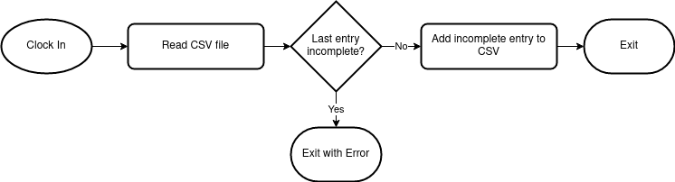
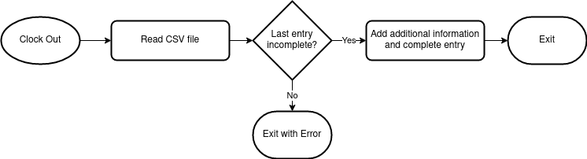

# TTracker
## What is ttracker
Simple CLI to track your work hours

## Build
### Dependencies
* Golang 1.18

### Instructions
```shell
git clone https://github.com/FritzJo/ttracker.git
cd ttracker
go build *.go
```

## Features
- [x] Clock-in / Clock-out
- [x] CSV based storage
- [ ] One file for each year
- [ ] Summary of hours worked overtime

## Process / Workflow
### Clock-In / Starting a work day



### Clock-Out / Ending a work day

